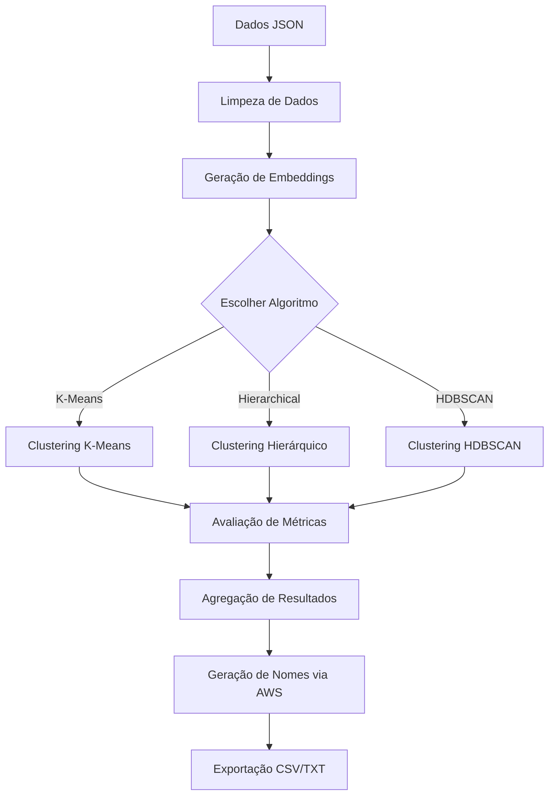

# Clustering Analysis Pipeline

Uma pipeline completa e robusta para análise de clustering de dados textuais usando múltiplos algoritmos de aprendizado não-supervisionado. Este projeto implementa, compara e avalia três principais métodos de clustering: K-Means, Hierarchical Clustering (Bottom-up) e Hierarchical Clustering (Top-down).

## 📋 Visão Geral

O Clustering Analysis Pipeline é uma solução integrada para:
- **Processamento de Dados**: Leitura e preparação de dados de múltiplas fontes JSON
- **Geração de Embeddings**: Utiliza modelos de transformers para criar representações vetoriais de textos
- **Clustering Automático**: Implementa três algoritmos diferentes de clustering
- **Avaliação Abrangente**: Calcula múltiplas métricas de qualidade dos clusters
- **Análise Agregada**: Consolida resultados de múltiplos modelos para comparação

## ✨ Características Principais

- ✅ **Múltiplos Algoritmos**: K-Means, Agglomerative Clustering, Bisecting K-Means, HDBSCAN
- ✅ **Embeddings Semânticos**: Integração com Sentence Transformers (all-MiniLM-L6-v2)
- ✅ **Métricas Multidimensionais**: 
  - Answer Relevancy
  - BERT Similarity
  - Correctness (GEval)
  - Prompt Alignment
- ✅ **Análise Comparativa**: Avalia múltiplos modelos de IA simultaneamente
- ✅ **Visualização Gerada**: Nomeação automática de clusters via AWS/LLM
- ✅ **Exportação Flexível**: Resultados em CSV e TXT

## 🔧 Requisitos

### Sistema
- Python 3.8+
- Linux/macOS/Windows
- 4GB+ de RAM (recomendado 8GB+)

### Dependências Principais
- pandas >= 1.3.0
- scikit-learn >= 1.0.0
- sentence-transformers >= 2.0.0
- numpy >= 1.19.0
- python-dotenv >= 0.19.0
- boto3 (para integração AWS)

## 📦 Instalação

### 1. Clone o Repositório
```bash
git clone https://github.com/ArthurFachel/Clustering-Analysis-Pipeline.git
cd Clustering-Analysis-Pipeline
```

### 2. Crie um Ambiente Virtual
```bash
python -m venv venv
source venv/bin/activate  # No Windows: venv\Scripts\activate
```

### 3. Instale as Dependências
```bash
pip install -r requirements.txt
```

### 4. Configure as Variáveis de Ambiente
```bash
cp .env.example .env
```

Edite o arquivo `.env` e defina:
```env
JSON_PATH="/caminho/para/seus/dados.json"
FOLDER_PATH="/caminho/para/pasta/modelos"
AWS_REGION="us-east-1"
AWS_KEY_ID="sua_chave_aws"
AWS_SECRET_KEY="sua_senha_aws"
```

## 📁 Estrutura do Projeto

```
Clustering-Analysis-Pipeline/
├── Clustering_Analysis_Pipeline.ipynb  # Notebook principal
├── README.md                           # Este arquivo
├── requirements.txt                    # Dependências Python
├── .env                                # Variáveis de ambiente
├── .gitignore                          # Arquivos ignorados
└── utils/                              # Módulos utilitários
    ├── run.py                          # Implementação dos algoritmos
    ├── evaluation.py                   # Funções de avaliação
    ├── metrics.py                      # Cálculo de métricas
    ├── aglomerar.py                    # Agregação de dados
    ├── assign.py                       # Atribuição de clusters
    ├── utils_IO.py                     # Entrada/saída
    └── AWS.py                          # Integração AWS
```

## 🚀 Como Usar

### Execução Básica

Execute o notebook principal:
```bash
jupyter notebook Clustering_Analysis_Pipeline.ipynb
```

### Execução por Script

```python
from utils.run import kmeans_model, hierarchical_clustering_bottom_top, hierarchical_clustering_top_bottom
import os
from dotenv import load_dotenv

load_dotenv()

# K-Means Clustering
df_kmeans, model = kmeans_model(chosen_k=5)

# Hierarchical (Bottom-Top)
df_bottom_top, model = hierarchical_clustering_bottom_top(chosen_k=5)

# Hierarchical (Top-Down)
df_top_down, model = hierarchical_clustering_top_down(chosen_k=5)
```

### Avaliação de Resultados

```python
from utils.evaluation import evaluate_kmeans, evaluate_top, evaluate_bottom

# Avaliar K-Means
results_kmeans = evaluate_kmeans(models_folder="/path/to/models", i=5)
results_kmeans.to_csv("kmeans_evaluation_5.csv", index=False)

# Avaliar Top-Down
results_top = evaluate_top(models_folder="/path/to/models", i=5)
results_top.to_csv("top_down_evaluation_5.csv", index=False)
```

## 🧠 Algoritmos de Clustering

### 1. K-Means
- **Descrição**: Particiona dados em k clusters baseado em centróides
- **Vantagens**: Rápido, escalável, interpretável
- **Desvantagens**: Requer predefinição de k, sensível a outliers
- **Uso Ideal**: Dados bem separados, clusters de tamanho similar

### 2. Hierarchical Clustering (Agglomerative)
- **Descrição**: Cria árvore de clusters através de merging bottom-up
- **Variantes**:
  - **Bottom-Top**: Começa com cada ponto como cluster
  - **Top-Down**: Começa com todos em um cluster, divide recursivamente
- **Vantagens**: Dendrográfico interpretável, não requer predefinição de k
- **Desvantagens**: Computacionalmente mais custoso
- **Uso Ideal**: Dados hierárquicos, exploração de estrutura

### 3. HDBSCAN (com suporte)
- **Descrição**: Clustering hierárquico baseado em densidade
- **Vantagens**: Detecta outliers, clusters de tamanhos variados
- **Desvantagens**: Parâmetros sensíveis, complexo
- **Uso Ideal**: Dados com clusters irregulares, presença de ruído

## 📊 Métricas de Avaliação

### Métricas Incluídas

| Métrica | Descrição | Intervalo |
|---------|-----------|-----------|
| **Answer Relevancy** | Quão relevante é a resposta ao prompt | 0-1 |
| **BERT Similarity** | Similaridade semântica via BERT | 0-1 |
| **Correctness (GEval)** | Avaliação de corretude automática | 0-1 |
| **Prompt Alignment** | Alinhamento com o prompt original | 0-1 |

### Cálculo do Score Agregado

```python
scores = [answer_relevancy, bert_similarity, correctness_geval, prompt_alignment]
score_final = mean(scores_válidos)
```

## 📈 Formato de Saída

### CSV
```
model,task,cluster,num_questions,score_mean,score_sum,answer_relevancy_mean,...
```

### TXT (Cluster Summaries)
```
[cluster_id]_[resumo_ia]_.txt
```

Cada arquivo contém os textos do cluster nomeados automaticamente via AWS.

## 🔌 Integração AWS

Para gerar nomes descritivos automáticos de clusters:

```python
from utils.AWS import generate

summary = generate("texto do cluster para sumarizar")
# Retorna: "Geração de Embeddings, Aprendizado Profundo"
```

**Configuração Necessária**:
- Variáveis de ambiente AWS configuradas
- Permissões IAM apropriadas
- Credenciais AWS válidas

## 📝 Exemplos de Uso

### Exemplo 1: Pipeline Completo

```python
from utils.utils_IO import json_to_df
from utils.run import kmeans_model

# Carregar dados
df_raw = json_to_df("data.json")

# Executar K-Means
for k in [3, 5, 10, 15]:
    df_result, model = kmeans_model(chosen_k=k)
    df_result.to_csv(f"results_kmeans_{k}.csv", index=False)
```

### Exemplo 2: Comparação de Métodos

```python
from utils.run import (
    kmeans_model,
    hierarchical_clustering_bottom_top,
    hierarchical_clustering_top_bottom
)

k = 10

results = {
    "kmeans": kmeans_model(k)[0],
    "bottom_top": hierarchical_clustering_bottom_top(k)[0],
    "top_bottom": hierarchical_clustering_top_bottom(k)[0]
}

# Análise comparativa
for method, df in results.items():
    print(f"{method}: {len(df)} pontos")
```

### Exemplo 3: Análise Agregada

```python
from utils.aglomerar import aglomerar
from utils.assign import assign_clusters
from utils.metrics import compute_score

# Agregar dados de múltiplos modelos
df = aglomerar("/path/to/model/results")

# Atribuir clusters
df = assign_clusters(df, embed_model, clustering_model)

# Computar scores
df["score"] = df.apply(compute_score, axis=1)

# Resumir por cluster
summary = (
    df
    .groupby(["model", "task", "cluster"], as_index=False)
    .agg({
        "score": ["mean", "std", "count"],
        "answer_relevancy": "mean",
        "bert_similarity": "mean"
    })
)
```

## 🔄 Fluxo de Trabalho Típico



## 🧪 Testes

Para testar a pipeline:

```bash
# Teste básico de importação
python -c "from utils.run import kmeans_model; print('✓ Pipeline importada com sucesso')"

# Teste com dados de exemplo
python examples/test_clustering.py
```

## 📊 Datasets Suportados

### Formato JSON
```json
{
  "section_name": {
    "question": ["pergunta1", "pergunta2"],
    "answer": ["resposta1", "resposta2"],
    "task": "qa"
  }
}
```

### Formato Interno Esperado
```
section | question | text | cluster | score | answer_relevancy | ...
```

## 🐛 Troubleshooting

### Erro: "ModuleNotFoundError: No module named 'utils'"
**Solução**: Execute a partir do diretório raiz do projeto
```bash
cd Clustering-Analysis-Pipeline
jupyter notebook
```

### Erro: "AWS credentials not found"
**Solução**: Configure as variáveis de ambiente
```bash
export AWS_KEY_ID="sua_chave"
export AWS_SECRET_KEY="sua_senha"
```

### Erro: "CUDA out of memory"
**Solução**: Reduza batch size no `utils_IO.py` ou use GPU com maior memória

### Embedding muito lento
**Solução**: Use modelo mais leve ou reduza dataset
```python
# Alternativa mais rápida
from sentence_transformers import SentenceTransformer
model = SentenceTransformer("all-MiniLM-L6-v2")  # Fast
# vs
model = SentenceTransformer("all-mpnet-base-v2")  # Mais lento mas melhor
```

## 📚 Referências e Documentação

- [Sentence Transformers](https://www.sbert.net/)
- [Scikit-learn Clustering](https://scikit-learn.org/stable/modules/clustering.html)
- [AWS Bedrock](https://aws.amazon.com/bedrock/)
- [DeepEval Metrics](https://github.com/confident-ai/deepeval)

## 📄 Estrutura de Diretórios de Saída

```
results/
├── K_Means/
│   ├── clusters/
│   │   ├── 0_cluster_name.txt
│   │   └── 1_cluster_name.txt
│   ├── csv/
│   │   └── kmeans_results.csv
│   └── plots/
├── Hierarchical/
│   ├── Top-Bottom/
│   └── Bottom-Top/
└── HDBSCAN/
    ├── clusters/
    ├── csv/
    └── plots/
```

## 🤝 Contribuindo

Contribuições são bem-vindas! Por favor:

1. Faça um Fork do projeto
2. Crie uma branch para sua feature (`git checkout -b feature/AmazingFeature`)
3. Commit suas mudanças (`git commit -m 'Add some AmazingFeature'`)
4. Push para a branch (`git push origin feature/AmazingFeature`)
5. Abra um Pull Request

## 📝 Changelog

### v1.0.0 (28/12/2024)
- ✨ Release inicial
- 🎯 Implementação de K-Means, Hierarchical Clustering, HDBSCAN
- 📊 Sistema de métricas multidimensionais
- 🔌 Integração AWS para nomeação de clusters
- 📈 Pipelines de avaliação e agregação

## 📄 Licença

Este projeto está licenciado sob a MIT License - veja o arquivo [LICENSE](LICENSE) para detalhes.

## 👨‍💻 Autor

**Arthur Fachel**  
GitHub: [@ArthurFachel](https://github.com/ArthurFachel)

## 📧 Contato e Suporte

Para dúvidas, sugestões ou relatório de bugs:
- 📬 Abra uma issue no GitHub
- 📧 Entre em contato via GitHub

## 🙏 Agradecimentos

- Comunidade Scikit-learn
- Hugging Face por Sentence Transformers
- AWS por Bedrock
- Comunidade DeepEval

---

**Última atualização**: Fevereiro, 2026